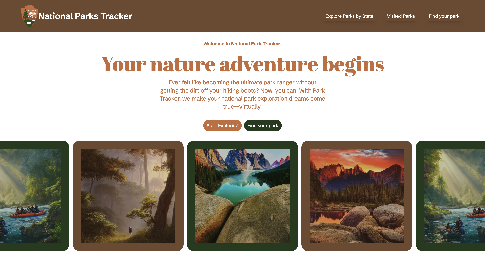

# National Parks Tracker



National Parks Tracker is a React and Next.js application that enables users to explore and keep track of their visits to national parks. The application provides information about various national parks, including details about camping facilities.

## Features

- **Park Directory:** Browse a comprehensive directory of national parks, each with its own dedicated page showcasing essential information.

- **Visited Parks Tracker:** Keep track of the national parks you've visited by marking them as "visited" on their respective pages.

- **Detailed Park Information:** Access detailed information about each national park, including camping facilities, entry requirements, and other relevant details.

## Getting Started

Follow these steps to get the National Parks Tracker up and running on your local machine:

1. **Clone the Repository:**
   ```bash
   git clone https://github.com/payneandrew/national-park-tracker.git
   ```
2. **Navigate to the Project Directory:**

   ```bash
   cd national-park-tracker
   ```

3. **Install Dependencies:**

   ```bash
   npm install
   ```

4. **Run the Application:**

   ```bash
   npm run dev
   ```

The application will be accessible at http://localhost:3000 in your web browser.

## Usage

- **Explore Parks:**
  - Navigate to the "Explore Parks" section to view a list of states.
  - Click on the state to view a list of national parks in that state.
  - Click on a park to view more detailed information.
- **Track Visited Parks:**
  - On each park's page, you can mark it as "visited" to keep track of the parks you've been to.
- **View Camping Information:**
  - Access camping information for each park, including facilities, reservation details, and more.
